# 可维护可拓展的 DevOps 和版本管理系统设计草案

> 方便起见，这里我们把所有认证相关的和辅助开发的物理资源、服务、规范、流程统称为 CI/CD，尽管已经远超这个词的最大语义范围

# 背景

自去年以来，公司已经明面上投入了可能超过 600 小时的工作量在运维和 DevOps 相关工作上，经手人员设计涉及李一喆、苏鹏、冯智洋、毛亦夫及一个实习生，直至今日也没有完成，折算为开发费用非常昂贵。同时，工作内容呈现出不可维护性和反复性，东一榔头西一棒槌，缺乏顶层设计，即使有了顶层设计也无人执行到底。

不可维护性体现在：

1. 受限于硬件预算和开发环境，各个组件的实装内容存在大量妥协，无法拓展
2. 受限于开发需求的紧迫性，无论是代码内还是代码外都大量存在开洞的状态，众多已开发过的工具事实上处于荒废的状态
3. 没有成型的规章制度保证开发、运维系统的稳定和可预测
4. 没有统一的源码管理和审查规范，缺乏源码质量的直观反馈，每一次提交都是存在很大风险的，导致特性分支迟迟无法安全合并
5. 缺乏维护文档，各种基础服务交错纵横，又无法安全迁移和升级

反复性体现在：

1. 仓库管理存在反复。在前期更是由于混乱的提交导致代码库巨量膨胀，不得不消耗两人周的时间重新整理代码并提交，时至今日，代码仓库的熵仍然在不可逆地快速增长，提交混乱，分支混乱。
2. 代码管理存在反复。由于没有合理的分支管理规范，谁在开发什么，进度如何，产生了多少问题缺乏统一的观测手段，目前强依赖于 Outline 中的文档交换信息——然而这样的信息是天然于源码之间没有关联手段的，Outline 的设计也不是为了临时性的信息交换。并且，当开发结束时，Outline 文档即被废弃，无法回溯。同时由于权限问题，Outline 文档无法被所有参与者看到。这是非常原始的、无法留档的交流手段。
3. 开发内容存在反复。主要存在于开发辅助工具中。代码的编译系统经历过多次改变，前期是由于需求的变更，后期则是由于想法的变化和经手人的变化，这是开发中的正常现象，且目前已趋于稳定。然而，例如流水线和 DevOps 的开发却是始终反复的，交接时下一位同事总是从头做起，每次都产生了一个全新版本的 CI/CD 设计，这主要有以下原因：

   1. 上一个版本的 CI/CD 没有用户，没有时间完善，因而也没有稳定的文档
   2. 缺乏统一的 Specification，导致迥然而异的设计风格，无法、或者没有意识复用此前的产出内容
   3. 因为打包、发布等子系统无人维护，也没有自动化工具和强规范保证其可以得到维护，逐渐被废弃，上一个版本的 CI/CD 逐渐失去支撑

然而，一个良好的 CI/CD 系统是必要的，它可以保证：

1. 我们可以不必投入人力验证每次更改是否是合理的、是否产生了退行、是否影响了编译，可以辅助较为安全地合并每次更改
2. 我们可以对代码质量进行量化，同时依据量化结果约束代码质量，从而获取对于项目健康状况的直观认识，同时为下文将提到的代码审查提供有力支撑
3. 我们可以自动化地验证项目的跨平台兼容性、自动化地组织部署和发布
4. 另外，也保证了 CI/CD 系统自身是可维护的，能够随着开发状况和团队需求的变化而安全、迅速地变化

这里提及的“良好的 CI/CD 系统“包括以下内涵：

1. 一个稳健的、宽松的硬件基础设施。

   1. 其容量足够大，足够容纳未来的扩展需求——基于当前情况设置上限是不合理的
   2. 有定期运行的、定时校验完好性的备份系统

2. 一个整洁的、方便维护&拓展和回滚的基础服务集合。这样的服务应当包含以下内容：

   1. 一个可以通览服务状态、可以实时预警的 Dashboard
   2. 一个内网的 CA 和 DNS 域名系统，使用 IP:Port 访问是难于维护、不宜迁移的
   3. 一个内网的邮件或通知系统，当代码产生变更或者出现新的评论时，开发人员应当知晓
   4. 一个中心化的认证系统，由于处在内网开发环境，我们对安全的需求并不高，因此认证系统不存在很强的升级需求，较为稳定，因此可以支持将身份和内容解耦，内容系统将可以更宽松地升级
   5. 一个备份和回滚系统，能够方便地组织备份文件
   6. 一些静态分析工具。采取定时、事件触发组合的形式，时刻更新代码的状况，以及支撑合并审查
   7. 一套测试与分布式测试框架和对应工具
   8. 一个容器管理、发布系统。方便打包开发环境和快速跨平台调试——对于一个物理机来说，恢复环境过于困难
   9. 一些容器和物理机。分布式执行静态分析、编译、测试、打包、发布流程
   10. 一些常用源的镜像

3. 一套层次分明，有一定强制性的执行规范和文档。没有人监督的系统会迅速变得荒芜。包括：

   1. 代码规范
   2. 提交规范
   3. 合并、代码审查规范
   4. 发布规范
   5. 基础服务维护规范
   6. 硬件维护规范

4. 有固定的人员维护。人员的变更将使得经验难于传递，系统的设计风格变得凌乱。

近期，由于田同学的加入，开始有望有固定的人实现这样一个系统，避免出现一直存在的开发窘境，当然避免笔者过去的产出和想法打水漂，写了此文。

**目标是**：收敛熵增，强制规范，自动化一切。

# 架构

在背景中，我们其实已经叙述了需求和愿景，这里直截了当地给出系统架构。此系统分为四层：

1. 物理基础设施层。包括核心服务器和虚拟节点，用于整备所有物理资源。
2. 核心服务层。包括所有服务与数据，使用 Docker 统一管理，构成公司的核心数字资产。
3. 执行与工作流层。基于核心服务执行数据管理、代码管理、编译测试等具体事务。
4. 规范与治理层（Specifications）。用于规范执行层的使用方式，定义规则。

## 物理基础设施层

### 着眼点

这一层次的设计受上层服务类型影响，主要考虑点为：

首先是**计算与管理分离**。GitLab 之类的服务与具体的计算任务，例如编译、测试等不可以放在同一台机器上，否则容易出现 IO 竞争和资源抢占，导致基础服务无法正常工作。因此我们划分为三类节点：

1. 管理节点（下称 OpsHost）：运行 GitLab、AD 域控、DNS、DHCP、Ansible 控制端。此类服务对 CPU 要求不高，但对 延迟和稳定性 极敏感。
2. 计算节点（下称计算节点）：运行编译、测试等计算密集型任务。此类服务对 CPU 要求极高，对延迟和稳定性要求不高。开发机也在此列。
3. 存储节点（下称存储节点）：运行存储服务，包括 iSCSI、NFS 等。此类服务对 CPU 要求不高，但对延迟和稳定性要求极高。

其次是**存储与服务分离**。其目的有两点：

1. 保证存储空间可随时拓展和备份，不会影响到服务本身的配置。如果运维做的好，甚至可以在核心服务保持运行的情况下，拓展或更换存储介质。
2. 服务无状态化，保证服务配置变更的安全性。更改 Dockerfile 之类的配置文件后，我们可以相信服务背后的数据——包括我们的代码仓库、各种二进制制品、文档都在独立存储介质的文件系统或数据库中。即使服务和计算节点硬件损坏，只需更换硬件并重新通过 PXE/Ansible 部署即可，不涉及数据迁移。

我们开发涉及到的持久化数据一般有三种：

1. GitLab 的仓库数据、Docker 镜像、二进制制品（包括模型文件、测试结果、编译结果等），它们通过 NFS/iSCSI 挂载在 TrueNAS 上
2. 践行 Iac (Infrastructure as Code)，服务本身的配置（Dockerfile, Ansible Playbooks etc.）也是代码，它们存储在仓库中，并在硬盘中保留文件备份，以防仓库宕机。
3. 底层保留 iSCSI 和 SAN 的拓展接口。当未来团队继续扩展，TrueNAS 读写遇到瓶颈时，可以只动存储单元，平滑引入分布式存储和高速内部网络，上层服务无感知，不需要重新配置服务。

另外，**测试环境**的硬件需要分层管理（测试流程也需要分层管理，下文会提及）。可选的测试环境方案有以下几类，依据隔离性、维护成本和适用场景进行对比：

我们只主要选择 1，5，6，7. 原因如下：

1. 环境方案 1 对应**本地开发环境**。开发机的性能将极大影响开发效率，因此我们尽量避免在开发机上添加任何虚拟环境，特别是在开启了 Hyper-V 的情况下，再使用 VMWare 构成了嵌套虚拟化。虚拟机相较于 Docker/WSL 来说不够轻量和便捷，相较于物理机来说又不够真实，不适合开发使用。推荐使用双系统开发或使用 Docker。
2. 环境方案 5 对应**Docker 集群化测试**。负责包括代码提交后的 CI 流水线，逻辑功能测试、接口测试、Headless 服务测试在内的各种与 GUI 无关的批量测试，Docker Container 实例资源丰富、易于拓展的特点将使得这一过程非常迅速和标准化。
3. 环境方案 6 对应**兼容性验证集群**。用于验证软件在不同 OS（Win10/Win11/Ubuntu/Kylin）下的安装与运行情况。同时，由于虚拟机也可以随意拓展（虽然成本高于 Docker），也便于开发者通过远程桌面前往调试一些 GUI 程序。
4. 环境方案 7 对应**跨平台裸机性能与硬件测试环境**。我们必需 Bare Metal 测试机，测试软件在真实硬件条件、真实使用场景下的表现。这些机器需要测试结束后重启通过脚本自动还原或切换回初始状态，避免环境发生漂移。这既保证了物理硬件的独占性，又解决了物理机环境难以重置的痛点。

然后是**开发环境**，开发环境最好使用 VHDX 文件启动，有需求的基于 Ventoy 配置双系统。这与目前基于镜像拷贝的装机模式差别不大，仍然保持充分的自由，不详述。事实上，我认为开发机应该包含尽可能多的内容，保证开盒即用——毕竟传东西到内网很麻烦，自己安装极其容易造成环境漂移，在此基础上，允许追求极致的稳定与习惯，这不同于测试机，测试机追求极致的灵活性与一致性。

最后，我们需要考虑**备份和断电**情况。

1. 备份一般遵循 3-2-1 备份原则，即 3 份数据副本，2 种不同的存储介质，1 份异地存放，但我们的需求并没有太复杂，因此可以设计简化的版本。另外，由于存储与服务分离的原则，我们不需要备份服务的 Docker Container，只需要备份 NAS 上的数据。
   1. 首先需要一个**热备份**。热备份频率高，可能一小时一次，并保留最新的数个~数十个记录，末尾循环删除。ZFS 分区支持快照。特别是因为众多服务都在同一台机器上，服务机最好做双机热备。
   2. 其次需要一个**冷备份**。冷备份频率低，可能一周一次，防止 NAS 物理损坏或机房事故。
   3. 最后需要对**服务配置单独备份**。服务配置备份触发于每次服务发生更改时，便于服务快速恢复，且数据量不会太大。
2. 针对机房可能出现的**异常断电**情况，必须建立软硬件联动的保护机制，防止文件系统损坏（特别是 ZFS 和数据库）。特别是 Linux 系统，断电时很容易造成系统和数据损坏。
   物理层面上，我们只需要多准备一个支持网络管理和 USB 通讯的 UPS，容量支持核心设备继续运行 20 分钟即可。断电发生时，若短时没有恢复，UPS 应当经由 NAS 通知服务层、计算层、存储层依次关闭，最后关闭物理设备。

### 架构设计

#### 网络拓扑和电源时序

综上所述，我们的内网基本物理架构和网络拓扑如下：

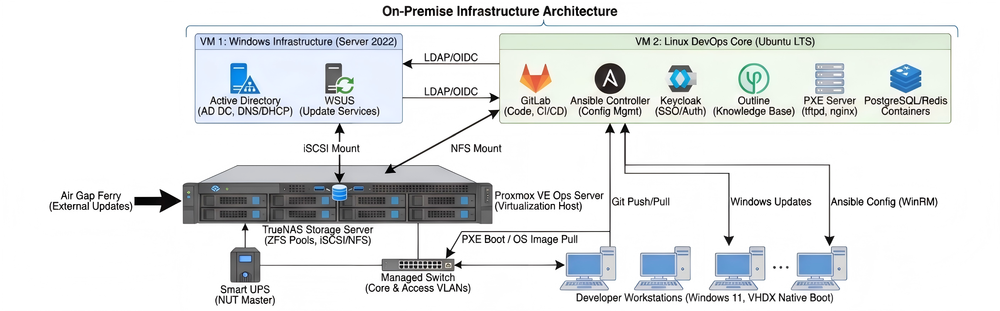

注意上图中`TrueNAS`没有画出，它应该在一台独立的机器上；VM2 现已拆分为 VM-2~4。异常断电相关的硬件和时序如图：


我们需要至少 4 台物理设备节点：

| 节点编号 | 设备角色       | 硬件                                                                    | 核心软件      |
| -------- | -------------- | ----------------------------------------------------------------------- | ------------- |
| P-01     | 数据服务器     | 需要较大的内存和极大的硬盘，当前内网 230 文件服务器可担此任             | TrueNAS Scale |
| P-02     | 核心服务中心   | 需要极大的内存和极强的处理器，高速缓存，当前内网 230 文件服务器可担此任 | TrueNAS Scale |
| E-01     | 摆渡数据服务器 | 存在于外网。用于定期更新上游镜像源数据，需要较大的硬盘，可以没有显示器  | Windows + WSL |
| Net-01   | 核心交换机     | 至少 4 口万兆，预留给 NAS 的热备，需要有管理控制台                      | Console       |

在 P-02 上运行 4 台虚拟机:
51

| VM 编号 | 规格               | 角色                     | 服务                 |
| ------- | ------------------ | ------------------------ | -------------------- |
| VM-1    | 4 核 8GB + 100GB   | 身份认证                 | AD 控制器、WSUS      |
| VM-2    | 8 核 32GB + 500GB  | 代码管理                 | GitLab               |
| VM-3    | 4 核 16GB + 200GB  | 二进制资产和第三方库管理 | JFrog                |
| VM-4    | 16 核 64GB + 500GB | 服务集群                 | 所有其他 Docker 服务 |

另外，我们还需要一台带有 USB 和网卡的 UPS，当机房断电时，通知 TrueNAS，让 TrueNAS 通过 NUT Service 通知 P-02 依次关闭所有服务，避免数据损坏。

#### 存储结构

由于数据重要性不同，我们使用分层存储设计，考虑负载和数据重要性，优化成本的同时保护核心机械硬盘的 IOPS 不被琐碎的镜像文件读写所榨干。共分三层：

1. 快速访问层。处理的数据有海量小文件、高频 IOPS、极低延迟要求特征，包括分布式编译缓存、数据库、短期日志、源码仓库、Docker服务的持久化数据等，强调快速访问和低延迟。同时，如果能提供快速回滚和抗风险特性将是极好的。因此，我们选择ZFS + RAID-10以提高随机读写性能和缩短重建耗时，并开启LZ4压缩。
2. 静态资产层。处理的数据包括历史编译制品、二进制依赖、LFS大对象、文档附件等，需要对大块数据顺序读写，需要高容量。因此可以使用HDD组建ZFS + RAID-Z2，并用SSD作为Special VDEV. 开启L2ARC缓存。
3. 持久化存储层。处理的数据包括外部镜像、更新包、系统镜像、冷备份等，其体量巨大，损坏代价较小，访问不频繁，对延迟也不频繁，因此可以用大容量 HDD 组建 RAID-Z2 或不配置 RAID. 开启ZFS + ZSTD-9 压缩以节省空间。

对应的大致硬件布局如下：

| 存储层级       | 硬件规格建议            | 数量 | 作用说明                                             |
| -------------- | ----------------------- | ---- | ---------------------------------------------------- |
| 系统盘         | 32GB NVMe               | 1    | 仅用于 TrueNAS 操作系统安装。                        |
| 全闪池 (Fast)  | 4~8TB NVMe SSD (企业级) | 4    | 组建 RAID-10，承载代码仓库、编译缓存及所有 VM 运行。 |
| 数据池 (Asset) | 16TB 企业级 HDD (现有)  | 5    | 组建 RAID-Z2，存放 LFS 大文件，提供约 36TB 净容量。  |
| 元数据加速     | 1TB/2TB NVMe SSD        | 2    | 组建 Mirror，作为 Asset-Pool 的 Special VDEV。       |
| 写缓存 (SLOG)  | 128GB/256GB 高寿命 NVMe | 1    | 提升 NFS 写入性能并保护断电数据安全。                |
| 读缓存 (L2ARC) | (可选) 现有 NVMe 扩充   | 1    | 进一步加速热点资产文件的读取。                       |

当然，如果有钱可以再扩充一倍，或将部分HHD替换为NVMe SSD.

这里我们大量使用了ZFS文件系统，因其提供了COW（写时复制）和校验和，保证数据完整性，并且内置压缩功能，支持快照和克隆，便于池化存储，而且支持内置的RAID-Z2，可以实现RAID-5的性能，同时提供RAID-6的容灾能力。

由于这部分与实际设备数量有关，这里仅为示例。如果按照上面数量安排的话，可以这样挂载：

| 挂载目标       | 对应 Dataset 路径     | 存储池选择  | 特殊配置项                                          |
| -------------- | --------------------- | ----------- | --------------------------------------------------- |
| VM 镜像        | fast-pool/iscsi-vms   | Fast-Pool   | Volblocksize=16k, 无压缩。                           |
| Git 源码       | fast-pool/git-source  | Fast-Pool   | Recordsize=64k, LZ4 压缩。                           |
| 编译缓存       | fast-pool/sccache     | Fast-Pool   | Deduplication=on (视 CPU 性能)。                     |
| LFS 资产       | asset-pool/gitlab-lfs | Asset-Pool  | Recordsize=1M, 异步写入。                            |
| MinIO 对象存储 | asset-pool/minio      | Asset-Pool  | Recordsize=1M, LZ4 压缩, 配额 8TB, 每日快照保留 7 天。 |
| 外部镜像       | mirror-pool/external  | Mirror-Pool | Compression=ZSTD, 权限只读。                         |

#### 子网规划

另外，根据节点角色不同，网路（包括物理网卡和虚拟网卡）需要划分为多个 VLAN。主要原因在于：

1. 像 Ops Server 和 NAS 之间的链路，存在数据量极大的情况，如果使用同一链路，将严重影响节点的性能。
2. 环境隔离。这里隔离不仅是让测试区、开发区与核心服务之间流量互不干扰，更是防止网络一部分异常导致网络整体瘫痪，甚至无法维护。因此，一台物理机可能需要多个 IP 地址。

这里我们把内网分为 5 个 VLAN:

1. VLAN 10: iSCSI/SAN 链路。只包含 NAS 和 Ops Server，供 PVE 宿主机挂载 TrueNAS 的磁盘。
   因为我们存储的不仅包括 Pip 镜像源这种带有大量琐碎文件的文件夹，更包括编译结果这类庞大又频繁读取的二进制文件，因此在这个 VLAN 中，需要全局开启巨型帧，使用万兆线，降低 CPU 处理开销，同时确保数据隔离。
2. VLAN 20: 开发区。包括所有开发者的开发机，主要执行分布式编译、拉取第三方库、下载依赖包等操作。要求不高。
3. VLAN 30: 测试区。包括三类测试节点：Docker Cluster, ESXi/PVE VMs Cluster, Bare Metals. 主要出口流量为编译、测试结果。视情况也可与 VLAN 20 合并。
4. VLAN 40: 核心服务农场。为虚拟化网段，托管从权限管理到节点状态检测的所有服务，通过 Traefik 实现服务自动发现与边缘路由，是整个内网流量的汇聚点。
5. VLAN 99: 管理区。仅供运维使用，包含 NAS, PVE, 交换机控制台，用于网络故障诊断。

我们使用标准的 C 类私有地址 192.168.x.0/24，其中 x 直接对应 VLAN ID，方便记忆：

| VLAN ID | 用途说明               | 网段 (CIDR)   | 网关 IP     | 掩码 | 核心策略                                                                                                               |
| ------- | ---------------------- | ------------- | ----------- | ---- | ---------------------------------------------------------------------------------------------------------------------- |
| VLAN 10 | SAN Storage (存储专用) | 10.10.10.0/24 | 无 (不配置) | /24  | MTU 9000。物理隔离，无路由，仅 PVE 和 NAS 互联。                                                                       |
| VLAN 20 | Dev Zone (开发区)      | 10.20.0.0/20  | .1          | /20  | 核心办公区。DHCP 动态分配，涵盖 10.20.0.x ~ 10.20.15.x，允许访问 VLAN 40。                                             |
| VLAN 30 | Test Zone (测试区)     | 10.30.0.0/20  | .1          | /20  | 测试机群/Docker 节点。DHCP 租期较短。DHCP 自动分配，涵盖 10.30.0.x ~ 10.30.15.x，访问受限，允许访问 VLAN 40 个别服务。 |
| VLAN 40 | Server Farm (服务区)   | 10.40.40.0/24 | .1          | /24  | 全静态 IP。核心服务器和 VM 所在地，不需要太大，保持精简。                                                              |
| VLAN 99 | OOB Mgmt (带外管理)    | 10.99.99.0/24 | .1          | /24  | 全静态 IP。仅管理员接入。                                                                                              |

VLAN 20 和 VLAN 30 这两个大网段包含了 4096 个地址，足够所有同事的所有设备使用，我们采用分层切片的策略，避免 IP 乱用导致管理混乱。以 VLAN 20 (Dev Zone) 为例 (10.20.0.0/20)：

| IP 范围                   | 用途           | 备注                                                 |
| ------------------------- | -------------- | ---------------------------------------------------- |
| 10.20.0.1                 | 网关 (Gateway) | 核心交换机虚接口 (SVI)                               |
| 10.20.0.2 - 10.20.0.9     | 网络设备       | 二层接入交换机、无线 AP 的管理地址                   |
| 10.20.0.10 - 10.20.0.254  | 静态预留       | 留给打印机、门禁、考勤机、特殊工控机                 |
| 10.20.1.0 - 10.20.14.254  | DHCP 动态池    | 员工终端池 (约 3500 个 IP)。办公电脑、手机、开发机。 |
| 10.20.15.0 - 10.20.15.254 | VIP / 临时     | 预留给访客网络或临时扩容                             |

VLAN 30 (Test Zone) 遵循同样的逻辑 (10.30.0.1 为网关，10.30.1.x 开始为 DHCP)。

| 设备名称 | 主机名      | 角色             | 管理口 IP (VLAN 99) | 存储口 IP (VLAN 10) | 业务口 IP (VLAN 40) |
| -------- | ----------- | ---------------- | ------------------- | ------------------- | ------------------- |
| Net-01   | switch-core | 核心交换机       | 10.99.99.2          | -                   | 10.40.40.1          |
| P-01     | nas-core    | TrueNAS 存储     | 10.99.99.10         | 10.10.10.10         | 10.40.40.5          |
| P-02     | pve-core    | PVE 宿主机       | 10.99.99.20         | 10.10.10.20         | 10.40.40.6          |
| VM-01    | win-infra   | Windows 基础服务 | -                   | -                   | 10.40.40.10         |
| VM-02    | gitlab-core | GitLab 核心      | -                   | -                   | 10.40.40.20         |
| VM-03    | jfrog-art   | JFrog 资产       | -                   | -                   | 10.40.40.30         |
| VM-04    | linux-apps  | Linux 应用       | -                   | -                   | 10.40.40.40         |

这样，在开发区同事看来，每个系统只有一张网卡，拥有唯一的 IP 地址——尽管它们可能含有多个虚拟机或者处于多个 VLAN 内。稍后的核心服务中的 DNS 一节将为这些地址添加内网域名。当 1000 台电脑接入网络时，AD/DHCP 应当自动注册以下格式的主机名，以便溯源：

- 开发机: `dev-{部门 ID}-{员工 ID}.coca.local` (例如: `dev-core-nekomiya.coca.local` -> 解析为 `10.20.x.x`)
- 测试机: `test-{资产编号}.coca.local` (例如: `test-001.coca.local` -> 解析为 `10.30.x.x`)

同时这些也是域名。尽管我们使用 DHCP 服务，但在 DHCP 服务器上根据 MAC 地址分配固定的 IP 地址，以方便审计。

## 核心服务层

### 着眼点

在物理基础设施之上，服务层是整个研发体系的数据源和数据交换核心。鉴于此前服务随处乱跑、配置无法追溯、故障无法定位的痛点，本层设计遵循以下原则：

1. 一切皆容器。除极少数强依赖 Windows 内核的服务（如 AD/WSUS）外，其余所有服务（Traefik, Keycloak, Docs, Monitoring 等）强制运行在 Docker Swarm 集群中, 确保了服务环境的一致性，方便服务的迁移、升级、回滚等操作。
2. 配置与数据分离，分为三部分：
   1. 镜像。镜像是无状态的，随时可以从外网更新或重新构建。作为 Docker 镜像，服务镜像也通过 JFrog Container Registry 保留历史版本。
   2. 配置。配置文件通过 GitLab 进行版本控制，通过 Ansible 或 Docker Configs 下发。
   3. 数据。严禁存储在容器内部。所有持久化数据（如数据库文件、附件、日志）必须挂载至 TrueNAS 提供的 NFS/iSCSI 卷或 MinIO 对象存储中。
3. 统一接入与观测。不再允许通过 IP:Port 裸奔访问服务。所有 HTTP/TCP 流量必须经过 Traefik 网关，通过内网域名（如 git.corp.local）访问。所有服务必须暴露 Prometheus Metrics 接口，日志统一收集至 Loki/Grafana，确保故障发生时有迹可循。

### 架构设计

服务层逻辑架构采用 Hub-Spoke 模式，以流量网关和身份认证为中心，驱动各个功能服务组。

### Active Directory 域设计

#### 设计原则

1. **单林单域**：`coca.local` 作为唯一域，避免多域信任复杂性
2. **分公司优先**：第一层按地理位置划分，支持管理委派
3. **职能次之**：第二层按职能划分，保持 RBAC 一致性
4. **最小权限**：分公司 IT 仅管理本地 OU，服务账户禁止交互登录
5. **自动化优先**：DHCP-DNS 动态注册，计算机自动加域

#### 域结构

> **当前阶段**：仅部署 HQ（总部），分公司 OU 预留但暂不创建。
> **扩展指引**：新增分公司时，复制 HQ 结构，创建 `OU=Branch-XX` 并配置委派。

```
coca.local (Forest Root Domain)
│
├── OU=Accounts                        # 用户账户
│   ├── OU=Employees                   # 正式员工
│   │   └── OU=HQ                      # 总部 (当前唯一)
│   │       ├── OU=Dev                 # 开发人员
│   │       ├── OU=QA                  # 测试人员
│   │       ├── OU=Ops                 # 运维人员
│   │       └── OU=Admin               # 管理层
│   │
│   │       # ══════ 未来分公司 (暂不创建) ══════
│   │       # OU=Branch-SH             # 上海分公司
│   │       #   ├── OU=Dev
│   │       #   ├── OU=QA
│   │       #   └── OU=Ops
│   │       # OU=Branch-BJ             # 北京分公司
│   │       # OU=Branch-SZ             # 深圳分公司
│   │       # ════════════════════════════════════
│   │
│   ├── OU=Contractors                 # 外包/实习生 (全局)
│   └── OU=ServiceAccounts             # 服务账户 (禁止交互登录)
│
├── OU=ManagedComputers                # 计算机账户
│   └── OU=HQ                          # 总部 (当前唯一)
│       ├── OU=Workstations
│       └── OU=Servers
│   │
│   │   # ══════ 未来分公司 (暂不创建) ══════
│   │   # OU=Branch-SH/{Workstations,TestMachines}
│   │   # OU=Branch-BJ/...
│   │   # OU=Branch-SZ/...
│   │   # ════════════════════════════════════
│   │
│   └── OU=Kiosks                      # 公共终端 (全局)
│
├── OU=Groups                          # 安全组
│   ├── OU=RoleGroups                  # 全局职能组 (RBAC)
│   ├── OU=ProjectGroups               # 项目组 (跨地点)
│   ├── OU=ResourceGroups              # 资源访问组
│   └── OU=BranchAdmins                # 分公司管理员组 (预留)
│
└── OU=ServicePrincipals               # gMSA 和 SPN
```

#### 分公司扩展指引

当公司扩展到多地点时，按以下步骤添加分公司：

1. **创建分公司 OU**：
   ```powershell
   # Example: Add Shanghai branch
   $branch = "Branch-SH"
   New-ADOrganizationalUnit -Name $branch -Path "OU=Accounts,DC=coca,DC=local"
   foreach ($role in @("Dev","QA","Ops")) {
       New-ADOrganizationalUnit -Name $role -Path "OU=$branch,OU=Accounts,DC=coca,DC=local"
   }
   # Repeat for OU=Computers
   ```

2. **创建分公司 IT 管理员组**：
   ```powershell
   New-ADGroup -Name "G-Branch-SH-IT" -GroupScope Global -Path "OU=BranchAdmins,OU=Groups,DC=coca,DC=local"
   ```

3. **配置管理委派**：
   ```powershell
   dsacls "OU=Branch-SH,OU=Accounts,DC=coca,DC=local" /G "COCA\G-Branch-SH-IT:GA" /I:T
   dsacls "OU=Branch-SH,OU=Computers,DC=coca,DC=local" /G "COCA\G-Branch-SH-IT:GA" /I:T
   ```

#### 分公司管理委派

> **当前阶段**：仅 HQ 需要委派，其他分公司待扩展时配置。

| 分公司 | 管理员组 | 委派范围 | 状态 |
|--------|----------|----------|------|
| 总部 | `G-HQ-IT` | `OU=HQ,OU=Employees,OU=Accounts` + `OU=HQ,OU=ManagedComputers` | ✅ 当前 |
| 上海 | `G-Branch-SH-IT` | `OU=Branch-SH,*` | ⏳ 待扩展 |
| 北京 | `G-Branch-BJ-IT` | `OU=Branch-BJ,*` | ⏳ 待扩展 |
| 深圳 | `G-Branch-SZ-IT` | `OU=Branch-SZ,*` | ⏳ 待扩展 |

**委派脚本示例**：
```powershell
# Grant Branch-SH-IT full control over Branch-SH OUs
dsacls "OU=Branch-SH,OU=Accounts,DC=coca,DC=local" /G "COCA\G-Branch-SH-IT:GA" /I:T
dsacls "OU=Branch-SH,OU=Computers,DC=coca,DC=local" /G "COCA\G-Branch-SH-IT:GA" /I:T
```

> **注意**：分公司 IT 管理员**无权**管理 `OU=ServiceAccounts`、`OU=Groups`、`OU=ServicePrincipals`，这些由总部 IT 统一管理。

#### 安全组设计 (AGDLP 模型)

> **AGDLP**：Account → Global → Domain Local → Permission
> - **OU 管人在哪**（地点，用于管理委派和 GPO）
> - **组管人能干什么**（项目组，用于权限控制）

##### 职能组 (RoleGroups)

| 组名 | 类型 | 成员 | 权限 |
|------|------|------|------|
| `G-Developers` | Global | 所有开发人员 | GitLab Developer, JFrog Read |
| `G-QA` | Global | 测试人员 | GitLab Reporter, 测试环境访问 |
| `G-Ops` | Global | 运维人员 | 所有服务管理权限 |
| `G-Admins` | Global | IT 管理员 | Domain Admins 委派 |
| `G-Contractors` | Global | 外包/实习 | 受限访问，90天自动过期 |

##### 项目组 (ProjectGroups) - 跨地点

| 组名 | 类型 | 成员 | 说明 |
|------|------|------|------|
| `G-Proj-Engine` | Global | 引擎组成员 (跨地点) | 核心引擎开发 |
| `G-Proj-CAD` | Global | CAD 组成员 | CAD 模块开发 |
| `G-Proj-Render` | Global | 渲染组成员 | 渲染模块开发 |
| `G-Proj-DevOps` | Global | DevOps 组成员 | CI/CD 和基础设施 |
| `G-Proj-QA-Core` | Global | 核心测试组 | 跨项目测试支持 |

> **示例**：张三 (上海Dev) 和李四 (北京Dev) 都属于 `G-Proj-Engine`，共享引擎仓库权限。

##### 资源访问组 (ResourceGroups)

| 组名 | 类型 | 成员 | 权限 |
|------|------|------|------|
| `DL-GitLab-Engine-Maintainer` | Domain Local | G-Proj-Engine 核心成员 | Engine 仓库 Maintainer |
| `DL-GitLab-Engine-Developer` | Domain Local | G-Proj-Engine | Engine 仓库 Developer |
| `DL-GitLab-CAD-Developer` | Domain Local | G-Proj-CAD | CAD 仓库 Developer |
| `DL-JFrog-Engine-Deploy` | Domain Local | G-Proj-Engine + CI 服务 | Engine 制品部署 |
| `DL-NAS-Engine-RW` | Domain Local | G-Proj-Engine | Engine 共享目录读写 |
| `DL-NAS-ReadOnly` | Domain Local | G-Developers | 公共资源只读 |

##### 权限继承示例

```
张三 (OU=Dev,OU=Branch-SH)
    ↓ 成员
G-Proj-Engine (项目组)
    ↓ 成员
DL-GitLab-Engine-Developer (资源组)
    ↓ 授权
GitLab Engine 仓库 Developer 权限
```

#### 服务账户规划

##### gMSA 账户 (推荐)

| 账户名 | 用途 | 允许获取密码的主机 | SPN |
|--------|------|-------------------|-----|
| `svc-gitlab` | GitLab LDAP 绑定 | VM-02 (gitlab-core) | `LDAP/gitlab.coca.local` |
| `svc-keycloak` | Keycloak AD 集成 | VM-04 (linux-apps) | `HTTP/sso.coca.local` |
| `svc-jfrog` | JFrog LDAP 认证 | VM-03 (jfrog-art) | `LDAP/jfrog.coca.local` |
| `svc-minio` | MinIO LDAP 认证 | VM-04 (linux-apps) | `HTTP/minio.coca.local` |
| `svc-grafana` | Grafana LDAP 认证 | VM-04 (linux-apps) | `HTTP/grafana.coca.local` |

> **gMSA (Group Managed Service Account)**：Windows 自动管理密码（每 30 天自动轮换），无需人工干预，推荐用于所有服务集成。

##### 普通服务账户

| 账户名 | 用途 | 密码策略 | 权限范围 |
|--------|------|----------|----------|
| `svc-ansible` | Ansible WinRM 连接 | 180天轮换 | 目标服务器本地管理员 |
| `svc-backup` | 备份任务执行 | 180天轮换 | TrueNAS SMB 读写 |
| `svc-wsus` | WSUS 服务运行 | 不过期 | 本地服务账户 |
| `svc-dhcp` | DHCP 动态 DNS 更新 | 不过期 | DNS 安全更新权限 |
| `svc-pve` | PVE LDAP 绑定 | 180天轮换 | AD 只读查询 |

##### gMSA 主机组

为控制哪些服务器可以获取 gMSA 密码，创建以下安全组：

| 组名 | 成员 | 说明 |
|------|------|------|
| `G-gMSA-LinuxApps` | VM-04 计算机账户 | Linux 服务 gMSA 访问 |
| `G-gMSA-GitLab` | VM-02 计算机账户 | GitLab gMSA 访问 |
| `G-gMSA-JFrog` | VM-03 计算机账户 | JFrog gMSA 访问 |

##### 服务账户安全策略

| 策略 | 配置 |
|------|------|
| 禁止交互登录 | 所有服务账户设置 `Deny log on locally` |
| 禁止 RDP 登录 | 所有服务账户设置 `Deny log on through Remote Desktop Services` |
| 审计登录 | 启用服务账户登录成功/失败审计 |
| 权限最小化 | 仅授予必要的 LDAP 读取权限，禁止写入 |

#### 闲时计算服务设计

> **需求**：开发组长需要在开发者电脑上运行闲时计算任务，但不能访问开发者个人文件。

##### 架构概览

```
开发组长 (G-TeamLeads)
    │
    ├─→ 登录 Ansible AWX (awx.coca.local)
    │       ↓
    │   选择计算任务模板，指定目标开发机
    │       ↓
    │   AWX 使用 svc-compute 账户通过 WinRM 连接
    │       ↓
    │   计算服务在开发机上运行
    │   - 运行身份: svc-compute
    │   - 可访问: 白名单目录 (见下表)
    │   - 禁止访问: C:\Users\*, 其他所有目录
    │       ↓
    └─→ 任务日志记录在 AWX (完整审计)
```

##### 白名单目录

| 目录 | 用途 | 权限 |
|------|------|------|
| `C:\ComputeJobs\` | 计算任务工作目录 | 读写 |
| `D:\SharedData\` | 共享数据目录 | 只读 |
| `C:\Tools\` | 计算工具目录 | 只读 |
| `\\nas-core\compute\` | NAS 计算结果存储 | 读写 |

> **其他所有目录**：svc-compute 账户无权访问，包括 `C:\Users\*`。

##### 相关安全组

| 组名 | 类型 | 成员 | 权限 |
|------|------|------|------|
| `DL-Compute-Targets` | Domain Local | 允许运行计算任务的开发机 | svc-compute WinRM 访问 |

> **组长权限**：不新增组，直接在 AWX 中为项目组内特定成员授予计算任务模板执行权限。
> 例如：`zhangsan@coca.local` (G-Proj-Engine 成员) 被授予 AWX "Engine Compute Job" 模板执行权限。

##### 服务账户

| 账户名 | 用途 | 密码策略 | 特殊配置 |
|--------|------|----------|----------|
| `svc-compute` | 闲时计算任务执行 | 180天轮换 | 白名单目录访问，禁止交互登录 |

##### GPO 配置

**GPO-Compute-Isolation** (链接到 `OU=Workstations,OU=HQ,OU=Computers`)：

| 策略项 | 配置 |
|--------|------|
| 文件系统权限 | svc-compute 仅允许访问白名单目录 |
| 登录限制 | svc-compute 禁止本地登录和 RDP |
| WinRM 访问 | svc-compute 允许 WinRM 远程执行 |
| 审计 | 记录 svc-compute 所有文件访问 |

##### Ansible AWX 配置

| 配置项 | 值 |
|--------|-----|
| **凭据** | svc-compute (Machine Credential, WinRM) |
| **清单** | 从 AD 动态同步 DL-Compute-Targets 组成员 |
| **模板权限** | 按项目组内特定成员授权（见下表） |
| **日志保留** | 90 天 |

##### AWX 模板权限示例

| 模板名称 | 授权用户 | 所属项目组 | 说明 |
|----------|----------|------------|------|
| Engine Compute Job | zhangsan@coca.local | G-Proj-Engine | 引擎组组长 |
| CAD Compute Job | lisi@coca.local | G-Proj-CAD | CAD 组组长 |
| Render Compute Job | wangwu@coca.local | G-Proj-Render | 渲染组组长 |

> **分级组长**：不同级别的组长可授予不同范围的模板权限。高级组长可访问多个项目的计算模板。

##### 任务模板示例

```yaml
# compute-job-template.yml
---
- name: Run idle compute task
  hosts: "{{ target_hosts }}"
  become: no
  vars:
    work_dir: C:\ComputeJobs\{{ job_id }}
  tasks:
    - name: Create job directory
      win_file:
        path: "{{ work_dir }}"
        state: directory

    - name: Copy compute script
      win_copy:
        src: "{{ script_path }}"
        dest: "{{ work_dir }}\\compute.ps1"

    - name: Execute compute task
      win_shell: |
        Set-Location "{{ work_dir }}"
        .\compute.ps1 -OutputDir "\\nas-core\compute\{{ job_id }}"
      register: result

    - name: Cleanup job directory
      win_file:
        path: "{{ work_dir }}"
        state: absent
      when: cleanup | default(true)
```

##### 用户体验流程

1. **组长登录 AWX**：使用 AD 账户 SSO 登录 `awx.coca.local`
2. **选择任务模板**：选择"闲时计算任务"模板
3. **指定参数**：选择目标开发机、计算脚本、输出目录
4. **执行任务**：AWX 自动使用 svc-compute 连接目标机器
5. **查看结果**：在 AWX 查看任务日志，结果存储在 NAS

#### 组策略对象 (GPO)

| GPO 名称 | 链接 OU | 策略内容 |
|----------|---------|----------|
| `GPO-Baseline-Security` | Domain | 密码策略、账户锁定、审计策略 |
| `GPO-Workstation-Config` | Computers/Workstations | WSUS 指向、电源管理、防火墙 |
| `GPO-Server-Hardening` | Computers/Servers | 禁用 USB、远程桌面限制、日志保留 |
| `GPO-Dev-Environment` | Accounts/Employees/Dev | 开发工具路径、环境变量 |
| `GPO-Contractor-Restrict` | Accounts/Contractors | 禁止本地管理员、限制登录时间 |
| `GPO-Compute-Isolation` | Computers/Workstations | svc-compute 白名单目录、WinRM 访问、审计 |
| `GPO-Browser-SSO` | Computers/Workstations | Chrome/Edge Kerberos SSO 配置 |

#### 密码和账户策略

| 策略项 | 值 | 说明 |
|--------|-----|------|
| 最小密码长度 | 12 字符 | 行业标准 |
| 密码复杂度 | 启用 | 大小写+数字+符号 |
| 密码最长使用期限 | 180 天 | 员工账户 |
| 账户锁定阈值 | 5 次 | 防暴力破解 |
| 账户锁定时间 | 30 分钟 | 自动解锁 |
| 服务账户密码 | 不过期 | gMSA 自动管理 |

#### 与其他服务集成

```
┌─────────────────────────────────────────────────────────────────┐
│                    coca.local (AD DS)                            │
│                         │                                        │
│    ┌────────────────────┼────────────────────┐                   │
│    │                    │                    │                   │
│    ▼                    ▼                    ▼                   │
│ ┌──────┐          ┌──────────┐         ┌─────────┐              │
│ │Keycloak│◄──LDAP──│ AD DS    │──LDAP──►│ GitLab  │              │
│ │ (SSO) │          │ (身份源) │         │         │              │
│ └───┬───┘          └────┬─────┘         └────┬────┘              │
│     │                   │                    │                   │
│     │ OIDC              │ Kerberos           │ LDAP              │
│     ▼                   ▼                    ▼                   │
│ ┌──────────────────────────────────────────────────┐             │
│ │  Outline, Mattermost, JFrog, Grafana, Portainer  │             │
│ │  (通过 Keycloak OIDC 单点登录)                    │             │
│ └──────────────────────────────────────────────────┘             │
└─────────────────────────────────────────────────────────────────┘
```

**集成方式**：
- **GitLab/JFrog**：直接 LDAP 绑定到 AD，使用 `svc-gitlab`/`svc-jfrog` 服务账户，支持组同步
- **其他 Web 服务**：通过 Keycloak 实现 OIDC 单点登录，Keycloak 后端对接 AD
- **Linux 服务器**：通过 SSSD + Kerberos 加入域，或使用 LDAP 认证
- **PVE 虚拟化平台**：LDAP 绑定到 AD，按组分配资源池权限

#### GitLab LDAP 组同步

> **目标**：AD 组变更自动同步到 GitLab，无需手动管理 GitLab 组成员。

##### LDAP 配置

```ruby
# /etc/gitlab/gitlab.rb
gitlab_rails['ldap_servers'] = {
  'main' => {
    'label' => 'COCA AD',
    'host' => 'ad.coca.local',
    'port' => 636,
    'uid' => 'sAMAccountName',
    'bind_dn' => 'CN=svc-gitlab,OU=ServiceAccounts,OU=Accounts,DC=coca,DC=local',
    'password' => '<from_vault>',
    'encryption' => 'simple_tls',
    'verify_certificates' => true,
    'base' => 'DC=coca,DC=local',
    
    # User filter
    'user_filter' => '(&(objectClass=user)(!(userAccountControl:1.2.840.113556.1.4.803:=2)))',
    
    # Group sync settings
    'group_base' => 'OU=Groups,DC=coca,DC=local',
    'admin_group' => 'G-Admins',
    'external_groups' => ['G-Contractors'],
    
    # Attribute mapping
    'attributes' => {
      'username' => 'sAMAccountName',
      'email' => 'mail',
      'name' => 'displayName'
    }
  }
}

# Sync schedule (every hour)
gitlab_rails['ldap_sync_worker_cron'] = '0 */1 * * *'
gitlab_rails['ldap_group_sync_worker_cron'] = '0 */1 * * *'
```

##### AD 组 → GitLab 组映射

| AD 组 | GitLab 组路径 | GitLab 角色 | 说明 |
|-------|---------------|-------------|------|
| G-Proj-Engine | engine | Maintainer | 引擎组 |
| G-Proj-CAD | cad | Developer | CAD 组 |
| G-Proj-Render | render | Developer | 渲染组 |
| G-Proj-DevOps | infra | Maintainer | DevOps 组 |
| G-Proj-QA-Core | qa | Reporter | 测试组 |
| G-Developers | developers | Developer | 所有开发者 (只读公共仓库) |
| G-Contractors | contractors | Reporter | 外包 (External User) |
| G-Admins | - | Admin | GitLab 管理员 |

##### GitLab 组同步配置 (Admin Area)

```
Admin Area > Groups > [Group] > Settings > LDAP Synchronization

Group: engine
├── LDAP Group CN: G-Proj-Engine
├── LDAP Access Level: Maintainer
└── Auto-sync: Enabled
```

##### 同步效果

```
1. IT 将张三加入 AD 组 G-Proj-Engine
       ↓ (LDAP 同步，每小时)
2. GitLab 自动将张三加入 engine 组
       ↓
3. 张三自动获得 engine/* 所有仓库 Maintainer 权限
       ↓
4. IT 将张三从 G-Proj-Engine 移除
       ↓ (LDAP 同步)
5. GitLab 自动移除张三的 engine 组成员资格
```

##### 项目组权限细分

对于需要更细粒度权限的场景，使用 Domain Local 资源组：

| AD 资源组 | GitLab 组路径 | 角色 | 说明 |
|-----------|---------------|------|------|
| DL-GitLab-Engine-Maintainer | engine | Maintainer | 核心成员 |
| DL-GitLab-Engine-Developer | engine | Developer | 普通成员 |
| DL-GitLab-CAD-Developer | cad | Developer | CAD 开发 |

> **AGDLP 应用**：用户 → G-Proj-Engine → DL-GitLab-Engine-Developer → GitLab Developer 权限

#### 一个账户走天下：组权限映射表

> **设计目标**：开发者使用 AD 域账户，无需记忆多个密码，即可访问所有有权限的资源。

##### 资源访问矩阵

| 资源 | G-Developers | G-QA | G-Ops | G-Admins | G-Contractors |
|------|:------------:|:----:|:-----:|:--------:|:-------------:|
| **开发机 RDP/SSH** | ✅ 本人 | ✅ 本人 | ✅ 全部 | ✅ 全部 | ✅ 本人 |
| **测试机 RDP/SSH** | 🔶 项目组 | ✅ 全部 | ✅ 全部 | ✅ 全部 | ❌ |
| **GitLab (Developer)** | ✅ | ✅ Reporter | ✅ | ✅ | 🔶 项目组 |
| **JFrog (Read)** | ✅ | ✅ | ✅ | ✅ | ✅ |
| **JFrog (Deploy)** | 🔶 项目组 | ❌ | ✅ | ✅ | ❌ |
| **MinIO (Read)** | ✅ | ✅ | ✅ | ✅ | ✅ |
| **MinIO (Write)** | 🔶 项目组 | ❌ | ✅ | ✅ | ❌ |
| **Grafana (View)** | ✅ | ✅ | ✅ | ✅ | ❌ |
| **Grafana (Edit)** | ❌ | ❌ | ✅ | ✅ | ❌ |
| **PVE (VM 管理)** | ❌ | ❌ | ✅ | ✅ | ❌ |
| **PVE (资源池分配)** | ❌ | ❌ | 🔶 本池 | ✅ | ❌ |
| **TrueNAS SMB** | 🔶 项目组 | 🔶 项目组 | ✅ | ✅ | ❌ |

> **图例**：✅ 完全访问 | 🔶 受限访问（按项目组或本人） | ❌ 无权限

##### 项目组细分权限

| 项目组 | GitLab 仓库 | JFrog 仓库 | MinIO Bucket | NAS 目录 |
|--------|-------------|------------|--------------|----------|
| G-Proj-Engine | engine/* (Maintainer) | engine-* (Deploy) | engine/ (RW) | /engine |
| G-Proj-CAD | cad/* (Developer) | cad-* (Read) | cad/ (RW) | /cad |
| G-Proj-Render | render/* (Developer) | render-* (Read) | render/ (RW) | /render |
| G-Proj-DevOps | infra/* (Maintainer) | * (Deploy) | * (RW) | /* |

#### Kerberos SSO 配置

实现浏览器自动登录（无需输入密码）：

##### 前置条件

1. 用户已登录域加入的 Windows 开发机
2. 浏览器配置信任 `*.coca.local` 域
3. 服务端配置正确的 SPN

##### SPN 注册

```powershell
# 为 Web 服务注册 SPN (在 DC 上执行)
setspn -S HTTP/git.coca.local svc-gitlab$
setspn -S HTTP/sso.coca.local svc-keycloak$
setspn -S HTTP/jfrog.coca.local svc-jfrog$
setspn -S HTTP/minio.coca.local svc-minio$
setspn -S HTTP/grafana.coca.local svc-grafana$
setspn -S HTTP/pve.coca.local svc-pve$
```

##### 浏览器配置 (GPO 下发)

| 浏览器 | 配置项 | 值 |
|--------|--------|-----|
| Chrome/Edge | `AuthServerAllowlist` | `*.coca.local` |
| Firefox | `network.negotiate-auth.trusted-uris` | `*.coca.local` |

##### 用户体验流程

```
1. 开发者开机 → 输入 AD 密码登录 Windows
2. 系统自动获取 Kerberos TGT (Ticket Granting Ticket)
3. 打开浏览器访问 git.coca.local
4. 浏览器自动发送 Kerberos Ticket → GitLab 验证 → 自动登录
5. 访问其他服务 (jfrog, minio, grafana...) → 同样自动登录
```

#### PVE AD 集成

##### 配置步骤

1. **PVE 添加 AD 域**：
   ```bash
   # /etc/pve/domains.cfg
   ad: coca.local
       base_dn DC=coca,DC=local
       bind_dn CN=svc-pve,OU=ServiceAccounts,OU=Accounts,DC=coca,DC=local
       server1 10.40.40.10
       secure 1
       default 0
   ```

2. **创建 PVE 服务账户**：
   ```powershell
   New-ADUser -Name "svc-pve" -SamAccountName "svc-pve" `
       -UserPrincipalName "svc-pve@coca.local" `
       -Path "OU=ServiceAccounts,OU=Accounts,DC=coca,DC=local" `
       -Enabled $true -PasswordNeverExpires $true
   ```

3. **配置 PVE 权限映射**：

   | AD 组 | PVE 角色 | 资源池 |
   |-------|----------|--------|
   | G-Ops | PVEAdmin | / (全部) |
   | G-Admins | Administrator | / (全部) |
   | G-Proj-Engine | PVEVMUser | /pool/engine |
   | G-Proj-CAD | PVEVMUser | /pool/cad |

##### PVE 权限命令

```bash
# 创建资源池
pvesh create /pools -poolid engine
pvesh create /pools -poolid cad

# 映射 AD 组到 PVE 角色
pveum acl modify /pool/engine -group 'coca.local\G-Proj-Engine' -role PVEVMUser
pveum acl modify / -group 'coca.local\G-Ops' -role PVEAdmin
```

### DNS 服务规划

为了方便管理 10~1000 台设备，域名命名规范必须具备层级性：

1. 根域名：coca.local， 指向 10.40.40.40 (Traefik 网关)
2. 开发机与测试机域名：
   1. dev-{部门 ID}-{员工 ID}.coca.local (例如: dev-core-nekomiya.coca.local -> 解析为 10.20.x.x)
   2. test-{资产编号}.coca.local (例如: test-001.coca.local -> 解析为 10.30.x.x)

其他服务以表格形式在这里给出：

1. 身份认证与网络基础设施：

   | 序号 | 服务名称       | 完整域名 (FQDN)      | 功能说明                                       | IP 地址     | DNS 配置备注                     |
   | :--- | :------------- | :------------------- | :--------------------------------------------- | :---------- | :------------------------------- |
   | 1    | Traefik        | traefik.coca.local   | 边缘网关，所有 HTTP 流量入口，自动服务发现。   | 10.40.40.40 | A 记录；\*.coca.local CNAME 到此 |
   | 2    | Keycloak (SSO) | sso.coca.local       | 统一身份验证入口 (LDAP/OIDC)，对接 AD。        | 10.40.40.40 | CNAME -> traefik                 |
   | 3    | Windows AD     | ad.coca.local        | Windows 活动目录，管理 50+ 开发者身份。        | 10.40.40.10 | A 记录；SRV 记录 \_ldap.\_tcp    |
   | 4    | AD DNS         | ad.coca.local        | AD 集成 DNS，支持动态更新和 SRV 记录。         | 10.40.40.10 | 与 AD DS 集成；所有客户端指向此  |
   | 5    | -              | -                    | (PowerDNS 可作为条件转发器或外部区域管理)      | -           | 可选                             |
   | 6    | DHCP           | -                    | 跨 VLAN 动态 IP 分配，配合 AD 自动注册主机名。 | 10.40.40.10 | 无需 DNS 记录                    |
   | 7    | TFTP (WDS)     | -                    | PXE 网络引导文件传输 (Windows Server WDS)。    | 10.40.40.10 | 无需 DNS 记录                    |
   | 8    | iPXE Server    | pxe.coca.local       | 自动化装机菜单，支持 Win/Linux 双系统 (HTTP)。 | 10.40.40.50 | A 记录                           |
   | 9    | WSUS           | wsus.coca.local      | Windows 补丁和更新分发管理。                   | 10.40.40.10 | A 记录                           |
   | 10   | Stalwart Mail  | mail.coca.local      | 内网邮件服务器，发送 Git/CI 通知。             | 10.40.40.40 | A 记录；MX 记录                  |

   **PXE 网络引导架构说明**：

   PXE 服务采用 Windows Server WDS 提供 TFTP，Ubuntu Server 提供 HTTP 镜像服务：

   ```
   客户端 PXE 启动
       ↓
   DHCP (Windows Server 10.40.40.10)
       ↓ Option 66/67 → WDS TFTP
   TFTP (Windows Server 10.40.40.10 - WDS)
       ↓ 提供 iPXE 引导文件
   iPXE chainload → HTTP (Ubuntu Server 10.40.40.50)
       ├── Windows → wimboot + WIM
       └── Linux → vmlinuz + initrd
   ```

   | 组件 | 位置 | IP |
   |------|------|-----|
   | DHCP + TFTP (WDS) | Windows Server | 10.40.40.10 |
   | HTTP (镜像+菜单) | Ubuntu Server | 10.40.40.50 |

2. 编译与测试流水线：

   | 序号 | 服务名称           | 完整域名 (FQDN)     | 功能说明                                | IP 地址     | DNS 配置备注     |
   | :--- | :----------------- | :------------------ | :-------------------------------------- | :---------- | :--------------- |
   | 1    | GitLab Runner      | runner.coca.local   | CI/CD 任务执行器状态监控。              | 10.40.40.40 | CNAME -> traefik |
   | 2    | Jenkins            | jenkins.coca.local  | 备用 CI/CD 引擎，复杂流水线编排。       | 10.40.40.40 | CNAME -> traefik |
   | 3    | MinIO (S3)         | s3.coca.local       | sccache 全局编译缓存后端，S3 兼容接口。 | 10.40.40.40 | CNAME -> traefik |
   | 4    | MinIO Console      | oss.coca.local      | MinIO 存储管理后台。                    | 10.40.40.40 | CNAME -> traefik |
   | 5    | Icecream Scheduler | distcc.coca.local   | 分布式编译集群调度中心。                | 10.40.40.40 | CNAME -> traefik |
   | 6    | SonarQube          | sonar.coca.local    | 代码静态分析与质量扫描。                | 10.40.40.40 | CNAME -> traefik |
   | 12   | Sentry             | sentry.coca.local   | 自建错误追踪与性能监控平台。            | 10.40.40.40 | CNAME -> traefik |
   | 13   | Symbol Server      | pdb.coca.local      | Windows PDB 符号服务器。                | 10.40.40.40 | CNAME -> traefik |

3. 协作与通信：

   | 序号 | 服务名称      | 完整域名 (FQDN)  | 功能说明                             | IP 地址     | DNS 配置备注     |
   | :--- | :------------ | :--------------- | :----------------------------------- | :---------- | :--------------- |
   | 1    | GitLab        | git.coca.local   | 核心代码托管、代码审查、CI/CD 中心。 | 10.40.40.20 | A 记录           |
   | 2    | Mattermost    | chat.coca.local  | 替代企业微信的开源内网聊天工具。     | 10.40.40.40 | CNAME -> traefik |
   | 3    | Outline       | docs.coca.local  | 团队知识库、技术 Spec 文档中心。     | 10.40.40.40 | CNAME -> traefik |
   | 4    | Wiki.js       | wiki.coca.local  | 备用 Wiki 系统，Markdown 文档协作。  | 10.40.40.40 | CNAME -> traefik |
   | 5    | ZenTao (禅道) | pm.coca.local    | 项目进度、Bug 跟踪、需求管理。       | 10.40.40.40 | CNAME -> traefik |
   | 6    | Nextcloud     | cloud.coca.local | 内网文件共享与协作平台。             | 10.40.40.40 | CNAME -> traefik |

4. 镜像与制品管理：

   | 序号 | 服务名称                 | 完整域名 (FQDN)          | 功能说明                             | IP 地址     | DNS 配置备注     |
   | :--- | :----------------------- | :----------------------- | :----------------------------------- | :---------- | :--------------- |
   | 1    | JFrog Artifactory        | jfrog.coca.local         | 制品库主入口 (Conan/Generic/Maven)。 | 10.40.40.30 | A 记录           |
   | 2    | JFrog Container Registry | docker.coca.local        | 私有 Docker 镜像仓库。               | 10.40.40.30 | A 记录           |
   | 3    | Ubuntu APT Mirror        | mirror.coca.local/ubuntu | Ubuntu 系统更新源镜像。              | 10.40.40.40 | CNAME -> traefik |
   | 4    | Kylin APT Mirror         | mirror.coca.local/kylin  | 麒麟系统更新源镜像。                 | 10.40.40.40 | CNAME -> traefik |
   | 5    | PyPI Mirror              | mirror.coca.local/pypi   | Python 依赖包镜像 (Bandersnatch)。   | 10.40.40.40 | CNAME -> traefik |
   | 6    | NPM Mirror               | mirror.coca.local/npm    | NPM 镜像 (Verdaccio)。               | 10.40.40.40 | CNAME -> traefik |
   | 7    | NuGet Mirror             | mirror.coca.local/nuget  | C# / .NET 依赖包镜像。               | 10.40.40.40 | CNAME -> traefik |
   | 8    | VS Layout                | mirror.coca.local/vs     | Visual Studio 离线安装布局仓库。     | 10.40.40.40 | CNAME -> traefik |
   | 9    | WSUS Mirror              | wsus.coca.local          | Windows 更新服务器。                 | 10.40.40.10 | A 记录           |
   | 10   | WinGet Mirror            | mirror.coca.local/winget | Windows 软件安装源镜像。             | 10.40.40.40 | CNAME -> traefik |
   | 11   | Open VSX                 | mirror.coca.local/vsx    | VS Code 插件市场私有化镜像。         | 10.40.40.40 | CNAME -> traefik |

5. 开发辅助工具：

   | 序号 | 服务名称               | 完整域名 (FQDN)       | 功能说明                          | IP 地址     | DNS 配置备注     |
   | :--- | :--------------------- | :-------------------- | :-------------------------------- | :---------- | :--------------- |
   | 1    | Compiler Explorer      | ce.coca.local         | 离线版，实时 C++ 汇编分析与优化。 | 10.40.40.40 | CNAME -> traefik |
   | 2    | SourceGraph            | search.coca.local     | 全局代码搜索与交叉引用导航。      | 10.40.40.40 | CNAME -> traefik |
   | 3    | Doxygen                | docs-api.coca.local   | 自动化生成的 C++ API 文档展示站。 | 10.40.40.40 | CNAME -> traefik |
   | 4    | Swagger UI             | swagger.coca.local    | REST API 文档与调试界面。         | 10.40.40.40 | CNAME -> traefik |
   | 5    | Draw.io                | draw.coca.local       | 离线流程图/架构图绘制工具。       | 10.40.40.40 | CNAME -> traefik |
   | 6    | Excalidraw             | excalidraw.coca.local | 手绘风格白板协作工具。            | 10.40.40.40 | CNAME -> traefik |
   | 7    | DevDocs                | devdocs.coca.local    | 离线开发文档聚合浏览器。          | 10.40.40.40 | CNAME -> traefik |
   | 8    | Kiwix (Stack Overflow) | kiwix.coca.local      | Stack Overflow 离线镜像。         | 10.40.40.40 | CNAME -> traefik |
   | 9    | IT-Tools               | tools.coca.local      | 开发者常用在线工具集合。          | 10.40.40.40 | CNAME -> traefik |
   | 10   | Shader Playpen         | shader.coca.local     | 着色器在线编辑与预览。            | 10.40.40.40 | CNAME -> traefik |

6. 运维与监控：

   | 序号 | 服务名称          | 完整域名 (FQDN)      | 功能说明                                 | IP 地址     | DNS 配置备注     |
   | :--- | :---------------- | :------------------- | :--------------------------------------- | :---------- | :--------------- |
   | 1    | Grafana           | monitor.coca.local   | 监控大屏，通览所有服务器状态。           | 10.40.40.40 | CNAME -> traefik |
   | 2    | Prometheus        | prom.coca.local      | 时序指标数据采集与存储。                 | 10.40.40.40 | CNAME -> traefik |
   | 3    | Grafana Phlare    | phlare.coca.local    | 持续性能剖析 (Continuous Profiling)。    | 10.40.40.40 | CNAME -> traefik |
   | 4    | Loki              | loki.coca.local      | 轻量级日志聚合系统。                     | 10.40.40.40 | CNAME -> traefik |
   | 5    | ELK Stack         | elk.coca.local       | Elasticsearch/Logstash/Kibana 日志分析。 | 10.40.40.40 | CNAME -> traefik |
   | 6    | Uptime Kuma       | status.coca.local    | 服务可用性监控（绿灯/红灯看板）。        | 10.40.40.40 | CNAME -> traefik |
   | 7    | Portainer         | portainer.coca.local | 可视化管理 Docker Swarm 集群。           | 10.40.40.40 | CNAME -> traefik |
   | 8    | NetBox            | net.coca.local       | IP 地址、资产、机架位管理。              | 10.40.40.40 | CNAME -> traefik |
   | 9    | Ansible Semaphore | ansible.coca.local   | Ansible 可视化任务调度与执行。           | 10.40.40.40 | CNAME -> traefik |
   | 10   | Terraform         | -                    | 基础设施即代码 (CLI)。                   | -           | 无需 DNS         |
   | 11   | Vault             | vault.coca.local     | 密钥与敏感配置管理。                     | 10.40.40.40 | CNAME -> traefik |
   | 12   | Adminer           | adminer.coca.local   | 轻量级数据库管理界面。                   | 10.40.40.40 | CNAME -> traefik |
   | 13   | RedisInsight      | redis.coca.local     | Redis 可视化管理工具。                   | 10.40.40.40 | CNAME -> traefik |
   | 15   | TrueNAS Scale     | nas.coca.local       | 存储管理界面。                           | 10.40.40.5  | A 记录           |
   | 16   | Proxmox VE        | pve.coca.local       | 虚拟化平台管理界面。                     | 10.40.40.6  | A 记录           |

### 外网同步内容

1. Apt/Kylin 源，Pip 源，NPM 源, openvsx，winget
2. VS、系统更新、resharper
3. 部分关键源码
4. 新的系统镜像

# 核心服务结构

## MinIO 对象存储设计

在核心服务层中，我们已经提到"所有持久化数据必须挂载至 TrueNAS 提供的 NFS/iSCSI 卷或 MinIO 对象存储中"。NFS/iSCSI 适合数据库文件、Git 仓库等 POSIX 语义的块/文件存储，而 MinIO 则负责所有 **非结构化二进制数据** 的统一管理——它提供 S3 兼容 API，天然适合海量 Blob 的存储、生命周期管理和跨服务共享。

### 着眼点

为什么需要独立的对象存储层，而不是全部挂 NFS？

1. **生命周期管理**。编译缓存 7 天过期、CI 制品 90 天归档、备份 180 天轮转——这些策略在 NFS 上需要自己写 cron + find，而 MinIO 原生支持 ILM (Information Lifecycle Management) 规则，声明式配置即可。
2. **多服务统一接入**。GitLab、Loki、Sentry、sccache 均原生支持 S3 后端，无需为每个服务单独挂载 NFS 卷和管理权限，统一通过 Access Key 鉴权。
3. **水平扩展**。当数据量增长时，MinIO 支持 Erasure Coding 和多节点扩展，而 NFS 的扩展路径（增加 HDD → 换更大 NAS → 分布式 NFS）远不如对象存储灵活。
4. **不可变性**。制品、备份等数据写入后不应被修改，MinIO 支持 Object Lock (WORM)，可以从存储层面防止误删和篡改。

### 部署架构

MinIO 部署在 VM-04 (linux-apps) 上，以 Docker 容器方式运行，数据目录挂载到 TrueNAS 的 Asset-Pool：

```
┌─────────────────────────────────────────────────────────────────┐
│  VM-04 (linux-apps)                                             │
│                                                                 │
│  ┌──────────────┐     ┌──────────────┐                          │
│  │ MinIO Server │────→│ MinIO Console│                          │
│  │ :9000 (API)  │     │ :9001 (Web)  │                          │
│  └──────┬───────┘     └──────────────┘                          │
│         │                                                       │
│         │  S3 API                                               │
│  ┌──────┴──────────────────────────────────────────────┐        │
│  │  Consumers:                                          │        │
│  │  • GitLab (LFS, Uploads)                             │        │
│  │  • JFrog (Conan 包, Docker 镜像层, CI 制品, 备份)   │        │
│  │  • sccache (分布式编译缓存)                          │        │
│  │  • Loki (日志 chunk 存储)                            │        │
│  │  • Sentry (crash dump / attachments)                │        │
│  │  • Nextcloud (文件 Blob)                            │        │
│  │  • Backup Scripts (GitLab/JFrog 备份归档)           │        │
│  └─────────────────────────────────────────────────────┘        │
│         │                                                       │
│         ▼  NFS mount                                            │
│  /mnt/asset-pool/minio-data/                                    │
└─────────────────────────────────────────────────────────────────┘
         │
         ▼  NFS over VLAN 10
┌─────────────────────────────────────────────────────────────────┐
│  P-01 (TrueNAS)                                                 │
│  asset-pool/minio       ← RAID-Z2 HDD + Special VDEV SSD      │
│  asset-pool/minio-warm  ← (可选) 冷数据分层                     │
└─────────────────────────────────────────────────────────────────┘
```

MinIO 单节点 Single-Drive 模式足以满足当前 50 人团队的需求。当未来数据量超过 10TB 或并发压力增大时，可以平滑迁移到 Erasure Coding 模式（最少 4 块盘）。

### Bucket 结构与数据分类

根据数据特征（生命周期、访问频率、重要性），我们将 MinIO 划分为以下 Bucket：

| Bucket 名称 | 数据内容 | 写入模式 | 访问频率 | 重要性 | 存储池 |
| --- | --- | --- | --- | --- | --- |
| `sccache` | 分布式编译缓存 (ccache/sccache) | 高频小文件写入 | 极高 | 低（可重建） | Asset-Pool |
| `gitlab-lfs` | Git LFS 大文件（模型、测试数据、大型资源） | 低频大文件写入 | 中 | 高 | Asset-Pool |
| `gitlab-uploads` | GitLab 用户上传（Issue 附件、MR 截图等） | 低频 | 低 | 中 | Asset-Pool |
| `jfrog-filestore` | JFrog Artifactory 二进制存储后端（Conan 包、Docker 镜像层、CI/CD 流水线制品、Generic 制品） | CI 上传 + 开发者拉取 | 高 | 极高 | Asset-Pool |
| `jfrog-backups` | JFrog 系统配置导出、数据库 dump | 每日/每周批量写入 | 极低 | 极高 | Asset-Pool |
| `loki-chunks` | Grafana Loki 日志数据块 | 持续追加写入 | 高 | 中 | Asset-Pool |
| `sentry-attachments` | Sentry 崩溃转储、附件 | 事件触发 | 低 | 中 | Asset-Pool |
| `backups` | GitLab 定时备份归档（全量备份、配置、数据库 dump） | 每日/每周批量写入 | 极低 | 极高 | Asset-Pool |
| `nextcloud-data` | Nextcloud 文件共享 Blob | 用户驱动 | 中 | 高 | Asset-Pool |

> **说明**：Conan 包管理、Docker 私有镜像仓库和 CI/CD 流水线制品（测试报告、覆盖率、构建产物）均由 JFrog Artifactory 承载——分别对应 Conan 仓库（`jfrog.coca.local`）、Container Registry（`docker.coca.local`）和 Generic 仓库。不使用 GitLab Package Registry 和 Dependency Proxy。JFrog 的 `filestore` 配置为 S3 后端，将所有二进制数据统一存入 MinIO 的 `jfrog-filestore` bucket，JFrog 自身只保留元数据索引，实现存储与服务的解耦。

### 生命周期策略 (ILM)

通过 MinIO 的 ILM 规则，自动管理数据的过期和清理，避免存储无限膨胀：

```bash
# 安装 mc (MinIO Client)
mc alias set coca http://s3.coca.local:9000 <access_key> <secret_key>

# sccache: 编译缓存 7 天过期，可重建，激进清理
mc ilm rule add coca/sccache \
    --expiry-days 7 \
    --noncurrent-expiry-days 1

# gitlab-lfs: LFS 对象不过期，但非当前版本 180 天后清理
mc ilm rule add coca/gitlab-lfs \
    --noncurrent-expiry-days 180

# gitlab-uploads: 用户上传 365 天过期
mc ilm rule add coca/gitlab-uploads \
    --expiry-days 365

# jfrog-filestore: 由 JFrog 自身的清理策略管理（jfrog-cleanup.sh），MinIO 侧不设过期
# 仅清理非当前版本（JFrog 删除后 MinIO 侧的残留标记）
mc ilm rule add coca/jfrog-filestore \
    --noncurrent-expiry-days 7

# jfrog-backups: JFrog 备份保留策略
mc ilm rule add coca/jfrog-backups \
    --prefix "daily/" --expiry-days 30
mc ilm rule add coca/jfrog-backups \
    --prefix "weekly/" --expiry-days 180

# loki-chunks: 日志保留 90 天
mc ilm rule add coca/loki-chunks \
    --expiry-days 90

# sentry-attachments: 崩溃数据 180 天过期
mc ilm rule add coca/sentry-attachments \
    --expiry-days 180

# backups: 备份保留策略
#   daily/ 前缀: 30 天
#   weekly/ 前缀: 180 天
mc ilm rule add coca/backups \
    --prefix "daily/" --expiry-days 30
mc ilm rule add coca/backups \
    --prefix "weekly/" --expiry-days 180

# nextcloud-data: 不过期，由 Nextcloud 自身管理
# (不设置 ILM 规则)
```

汇总视图：

| Bucket | 过期策略 | Object Lock | 版本控制 | 预估容量 |
| --- | --- | --- | --- | --- |
| `sccache` | 7 天 | 否 | 否 | 50~200 GB |
| `gitlab-lfs` | 不过期（非当前版本 180 天） | 否 | 是 | 500 GB~2 TB |
| `gitlab-uploads` | 365 天 | 否 | 否 | 10~50 GB |
| `jfrog-filestore` | 不过期（由 JFrog 清理策略管理） | 是 (Governance) | 是 | 2~8 TB |
| `jfrog-backups` | daily/ 30 天, weekly/ 180 天 | 是 (Compliance) | 是 | 200 GB~1 TB |
| `loki-chunks` | 90 天 | 否 | 否 | 50~200 GB |
| `sentry-attachments` | 180 天 | 否 | 否 | 20~100 GB |
| `backups` | daily/ 30 天, weekly/ 180 天 | 是 (Compliance) | 是 | 500 GB~2 TB |
| `nextcloud-data` | 不过期 | 否 | 是 | 100~500 GB |

总预估容量约 **2.5~11 TB**，在 Asset-Pool (RAID-Z2, ~36TB 净容量) 中占比约 7%~30%，留有充足余量。

### 访问控制

MinIO 使用独立于 AD/Keycloak 的 Access Key 体系（因为大部分消费者是服务而非人），按最小权限原则为每个服务创建专用凭据：

```bash
# 创建服务专用策略和用户
# GitLab — 读写 gitlab-* bucket（LFS, Artifacts, Uploads）
mc admin policy create coca gitlab-policy /etc/minio/policies/gitlab.json
mc admin user add coca gitlab-svc <password>
mc admin policy attach coca gitlab-policy --user gitlab-svc

# JFrog — 读写 jfrog-filestore（S3 filestore 后端）+ 写入 jfrog-backups
mc admin policy create coca jfrog-policy /etc/minio/policies/jfrog.json
mc admin user add coca jfrog-svc <password>
mc admin policy attach coca jfrog-policy --user jfrog-svc

# sccache — 仅读写 sccache bucket
mc admin policy create coca sccache-policy /etc/minio/policies/sccache.json
mc admin user add coca sccache-svc <password>
mc admin policy attach coca sccache-policy --user sccache-svc

# Loki — 仅读写 loki-chunks bucket
mc admin policy create coca loki-policy /etc/minio/policies/loki.json
mc admin user add coca loki-svc <password>
mc admin policy attach coca loki-policy --user loki-svc

# Backup — 仅写入 backups bucket（不可删除，配合 Object Lock）
mc admin policy create coca backup-policy /etc/minio/policies/backup.json
mc admin user add coca backup-svc <password>
mc admin policy attach coca backup-policy --user backup-svc
```

策略文件示例（`/etc/minio/policies/sccache.json`）：

```json
{
    "Version": "2012-10-17",
    "Statement": [
        {
            "Effect": "Allow",
            "Action": ["s3:GetObject", "s3:PutObject", "s3:DeleteObject", "s3:ListBucket"],
            "Resource": ["arn:aws:s3:::sccache", "arn:aws:s3:::sccache/*"]
        }
    ]
}
```

### 与 TrueNAS 存储池的映射

MinIO 的数据目录通过 NFS 挂载到 TrueNAS 的 Asset-Pool 上。在 TrueNAS 中创建专用 Dataset：

| Dataset 路径 | 用途 | Recordsize | 压缩 | 配额 | 快照策略 |
| --- | --- | --- | --- | --- | --- |
| `asset-pool/minio` | MinIO 主数据目录 | 1M | LZ4 | 8 TB (软限) | 每日快照，保留 7 天 |

> **说明**：MinIO 内部以对象为单位存储，对象大小差异极大（sccache 几 KB ~ LFS 几 GB），选择 1M recordsize 是对大文件顺序写入的优化。小文件的额外空间浪费由 LZ4 压缩部分抵消。如果未来 sccache 的小文件 IOPS 成为瓶颈，可以将 sccache bucket 拆分到 Fast-Pool 的独立 Dataset（recordsize=64K）上。

Docker Compose 挂载配置：

```yaml
# ~/coca-services/tier1-core/minio/docker-compose.yml
services:
  minio:
    image: minio/minio:latest
    container_name: minio
    command: server /data --console-address ":9001"
    environment:
      MINIO_ROOT_USER: "${MINIO_ROOT_USER}"
      MINIO_ROOT_PASSWORD: "${MINIO_ROOT_PASSWORD}"
      MINIO_BROWSER_REDIRECT_URL: "https://oss.coca.local"
      MINIO_SERVER_URL: "https://s3.coca.local"
    volumes:
      - /mnt/asset-pool/minio:/data
    ports:
      - "9000:9000"   # S3 API
      - "9001:9001"   # Console
    networks:
      - traefik-public
      - backend
    labels:
      - "traefik.enable=true"
      # S3 API
      - "traefik.http.routers.minio-api.rule=Host(`s3.coca.local`)"
      - "traefik.http.routers.minio-api.service=minio-api"
      - "traefik.http.services.minio-api.loadbalancer.server.port=9000"
      # Console
      - "traefik.http.routers.minio-console.rule=Host(`oss.coca.local`)"
      - "traefik.http.routers.minio-console.service=minio-console"
      - "traefik.http.services.minio-console.loadbalancer.server.port=9001"
    deploy:
      resources:
        limits:
          memory: 4G
    healthcheck:
      test: ["CMD", "mc", "ready", "local"]
      interval: 30s
      timeout: 10s
      retries: 3
    restart: unless-stopped
```

### 各服务集成配置要点

| 服务 | 配置方式 | 关键参数 |
| --- | --- | --- |
| **GitLab** | `gitlab.rb` 中配置 `object_store` | `connection.endpoint = "http://s3.coca.local:9000"`, `consolidate = true`（仅 LFS、Uploads，CI 制品走 JFrog） |
| **JFrog Artifactory** | `binarystore.xml` 配置 S3 filestore | `<provider id="s3-storage">`, `endpoint: http://s3.coca.local:9000`, `bucketName: jfrog-filestore`；CI 制品通过 Generic 仓库 `ci-artifacts-local` 存储 |
| **sccache** | 环境变量 | `SCCACHE_BUCKET=sccache`, `SCCACHE_ENDPOINT=http://s3.coca.local:9000`, `SCCACHE_S3_USE_SSL=false` |
| **Loki** | `loki.yaml` 中 `storage_config.aws` | `s3: http://s3.coca.local:9000/loki-chunks`, `s3forcepathstyle: true` |
| **Sentry** | `sentry.conf.py` 中 `SENTRY_OPTIONS` | `filestore.backend: s3`, `filestore.options.bucket_name: sentry-attachments` |
| **Nextcloud** | 管理后台 → 外部存储 | S3 兼容存储，bucket: `nextcloud-data` |
| **Backup 脚本** | `mc cp` / `aws s3 cp` | GitLab: `mc cp ... coca/backups/daily/`; JFrog: `mc cp ... coca/jfrog-backups/daily/` |

### 监控与告警

MinIO 原生暴露 Prometheus Metrics（`/minio/v2/metrics/cluster`），接入已有的 Grafana + Prometheus 监控栈：

| 指标 | 告警阈值 | 说明 |
| --- | --- | --- |
| `minio_cluster_disk_total_free_bytes` | < 20% 剩余 | 存储空间不足 |
| `minio_s3_requests_errors_total` (5xx) | > 10/min | 服务端错误激增 |
| `minio_node_process_uptime_seconds` | = 0 | MinIO 进程宕机 |
| `minio_bucket_usage_total_bytes` (per bucket) | 超过预估容量 2x | 某 bucket 异常增长 |

### 容量规划与扩展路径

```
阶段 1 (当前, 50 人团队):
  Single-Node Single-Drive
  Asset-Pool NFS 挂载, 预估 2~4 TB
  ↓
阶段 2 (100+ 人, 数据 > 10 TB):
  Single-Node Erasure Coding (4 drives)
  拆分热数据 (sccache) 到 Fast-Pool
  ↓
阶段 3 (500+ 人, 数据 > 50 TB):
  Multi-Node Distributed MinIO
  独立存储节点, 万兆互联
  引入 MinIO Tiering (热→温→冷自动分层)
```

## 二进制数据流转总览

综合 JFrog Artifactory（Conan 包 + Docker 镜像管理）和 MinIO（对象存储），公司的二进制数据按用途分为以下类别，各有明确的存储归属：

| 数据类型 | 管理入口 | 实际存储位置 | 管理方式 | 生命周期 |
| --- | --- | --- | --- | --- |
| 编译中间文件 (sccache/ccache) | sccache CLI | MinIO `sccache` bucket | ILM 自动过期 | 7 天 |
| Conan 包 (带版本) | JFrog `conan-local` | MinIO `jfrog-filestore` bucket (S3 后端) | jfrog-cleanup.sh 保留策略 | 保留最近 N 版本 + stable |
| Docker 私有镜像 | JFrog Container Registry | MinIO `jfrog-filestore` bucket (S3 后端) | JFrog GC + 镜像 tag 策略 | 按 tag 策略保留 |
| CI/CD 流水线制品 | JFrog Generic 仓库 `ci-artifacts-local` | MinIO `jfrog-filestore` bucket (S3 后端) | JFrog 清理策略 | 90 天（按路径前缀清理） |
| Git LFS 大文件 | GitLab LFS | MinIO `gitlab-lfs` bucket | 版本控制 + 非当前版本过期 | 当前版本永久, 旧版本 180 天 |
| 镜像源 (APT/PyPI/NPM) | 静态文件服务 / JFrog Remote | NFS 或 JFrog 本地缓存 | 外网同步脚本定期更新 | 持续更新 |
| GitLab 备份 | backup 脚本 | MinIO `backups` bucket (Object Lock) | ILM 分层过期 | daily/ 30 天, weekly/ 180 天 |
| JFrog 备份 | backup 脚本 | MinIO `jfrog-backups` bucket (Object Lock) | ILM 分层过期 | daily/ 30 天, weekly/ 180 天 |

> **核心设计**：JFrog Artifactory 的 `filestore` 配置为 S3 后端（指向 MinIO `jfrog-filestore` bucket），JFrog 自身数据库仅存储元数据索引。这意味着所有 Conan 包、Docker 镜像层和 CI/CD 流水线制品的实际二进制数据都统一存储在 MinIO 中，享受 Asset-Pool 的 RAID-Z2 冗余保护和 ZFS 快照能力，同时 JFrog 服务本身变为近乎无状态，便于升级和迁移。

## 执行与工作流层

这一层定义了数据如何在上述服务间流转，构成了日常开发的具体路径。

### 3.1 典型开发工作流

1. **需求与分支**：开发者从 `main` 分支检出特性分支 `feature/xxx`。
2. **提交与验证**：本地开发提交代码，触发 Pre-commit 钩子进行简单的格式化和静态检查。
3. **合并请求 (MR)**：推送到 GitLab，创建 Merge Request。
4. **自动化流水线**：
   - CI 服务拉取代码。
   - 运行单元测试和静态分析（SonarQube）。
   - 构建测试制品。
   - **反馈**：流水线状态和质量报告直接回写到 MR 评论区。
5. **代码审查**：资深开发者/MaintainerReview 代码，结合自动化的质量报告决定是否合并。
6. **合并与发布**：合并入 `main`，触发发布流水线，生成正式版本制品推送到 Nexus/Harbor，并自动更新文档。

### 3.2 运维与维护工作流

1. **基础设施即代码 (IaC)**：所有服务的配置变更（如 Nginx 配置、Docker Compose 文件）通过 Git 仓库管理。
2. **配置漂移检测**：定期运行检查脚本，确保实际环境与 Git 配置一致。
3. **备份策略**：
   - **数据库**：每日全量备份，每小时增量备份。
   - **代码库**：实时镜像或高频快照。
   - **验证**：每周自动化运行一次“备份恢复演练”，在一个隔离环境中尝试从备份恢复核心服务，确保备份文件有效。

---

## 规范与治理层 (Specifications)

规范是自动化的基石。

### 4.1 代码库规范

- **Monorepo vs Polyrepo**：明确项目的仓库策略。对于强依赖组件，建议 Monorepo 以保证原子性提交。
- **目录结构**：统一所有项目的顶层目录结构（e.g., `/src`, `/docs`, `/scripts`, `/tests`）。

### 4.2 分支与提交规范

- **分支模型**：采用 Trunk Based Development 或 简化版 Git Flow。主分支必须保持随时可发布状态。
- **Commit Message**：强制遵循 [Conventional Commits](https://www.conventionalcommits.org/) 规范（feat, fix, docs, style, refactor...），以便自动化生成 Changelog。

### 4.3 版本号规范

- 遵循 **Semantic Versioning (SemVer 2.0.0)**。
- 所有的发布制品必须打上版本 Tag，禁止使用 `latest` 这种不确定的标签部署生产环境。

### 4.4 审查规范

- **Checklist**：MR 模板中包含自查清单（文档是否更新？测试是否通过？）。
- **最少人数**：核心模块至少需要 2 人 Approval 方可合并。

### 4.5 硬件与资源规范

- **命名规范**：服务器、虚拟机、容器需遵循统一的命名规则（e.g., `role-region-index`）。
- **标签管理**：利用 Label 管理构建节点的能力（e.g., `windows`, `linux`, `gpu`, `high-mem`），确保任务调度到正确的节点。

# 具体实施步骤

我们假定物理层已经按照网络规划完成了网络设备的配置。我们的管理机目前已经接入VLAN 99，IP为10.99.99.254.

## TrueNAS

首先使用TrueNAS的ISO安装TrueNAS系统，创建Admin时选择Configure in Web UI。

在完成物理安装并重启后，P-01 会进入 TrueNAS Scale 的 Console Setup 蓝底菜单界面。由于我们正处于物理隔离环境且需要严格遵循 10.x.x.x 的网络规划，你需要手动完成以下初始化步骤：

1. 在TrueNAS终端中配置网络接口(Configure Network Interfaces)。三张分属VLAN 10, VLAN 40, VLAN 99的网卡分别分配IP(Alias) 10.10.10.10/24, 10.40.40.5/24, 10.99.99.11/24。VLAN 10的MTU设置为9000以支持巨型帧，VLAN 40的MTU设置为1500，VLAN 99的MTU设置为1500。
2. 配置默认路由与 DNS(Configure Default Settings)。虽然内网物理隔离，但为了后续与 VM-01 (DNS) 通讯，必须预设好指向。设置Host Name为 nas-core, Domain为 coca.local，GateWay 为 10.40.40.1（核心交换机网关），DNS Server 1为 10.40.40.10（指向未来的 VM-01 Windows AD/DNS），DNS Server 2为 10.40.40.1（核心交换机备用）。
　　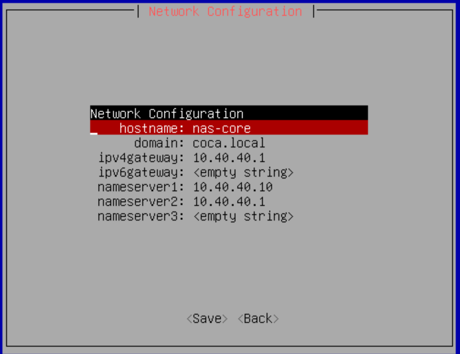

此时我们应该已经可以通过管理机访问http://10.99.99.11，浏览器访问的话你应该能看到TrueNAS的Web界面。选择Administrator User并设置好密码。
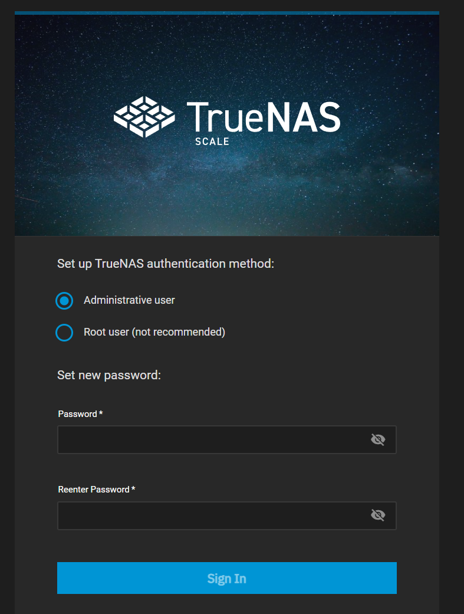

下面我们来配置逻辑磁盘（示例）。

1. 创建存储池Storage -> Create Pool
   
   1. 创建Fast-Pool, 组成RAID-10
   2. 创建Asset-Pool, 组成RAID-Z2，并设置SSD为Special VDEV用于元数据加速
2. 创建ZFS卷（ZVol）。Datasets -> Fast-Pool
   
   创建Fast-Pool/iscsi-vms
   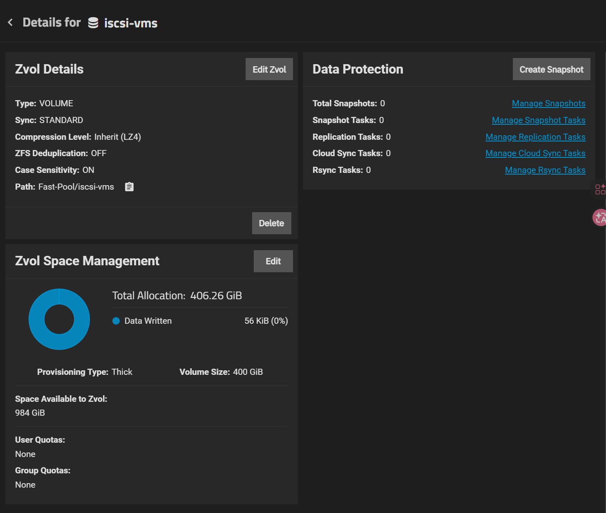
3. 开启iSCSI服务，Portal绑定到VLAN 10的10.10.10.10（TrueNAS在VLAN 10的IP），Initiator允许PVE 10.10.10.20访问，Target 关联到LUN0. (System Settings > Services)

TrueNAS支持SSH链接和专属命令行，也可以使用命令行执行脚本，这符合IaC的理念。

## PVE 

### PVE 安装与磁盘配置

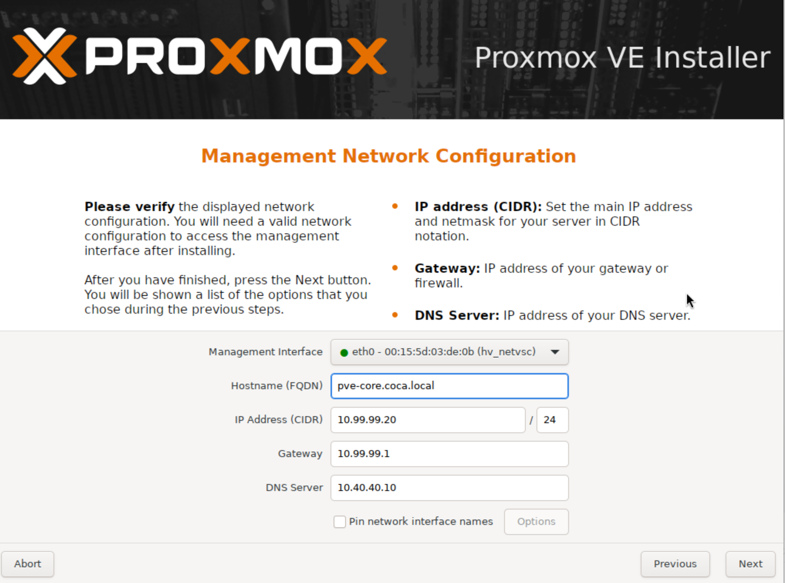

此时访问10.99.99.20:8006，你应该能看到PVE的Web界面。

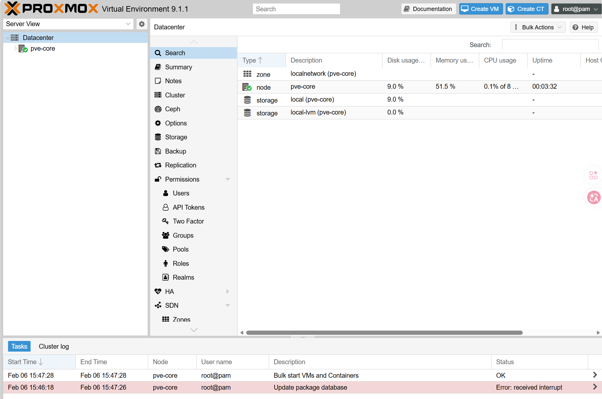

设置好网络参数，PVE应该可以访问VLAN 10, VLAN 40, VLAN 99。

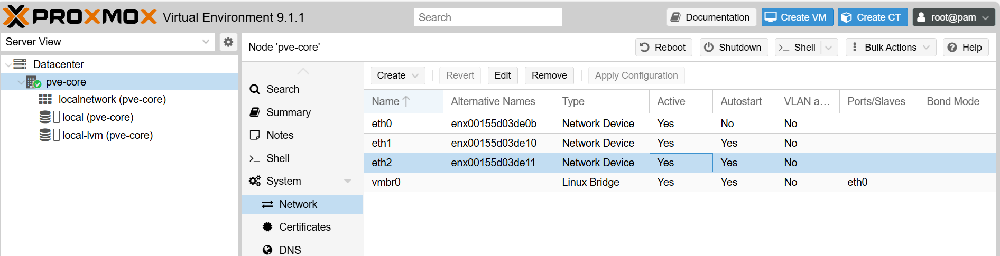

添加我们创建的iSCSI Target。

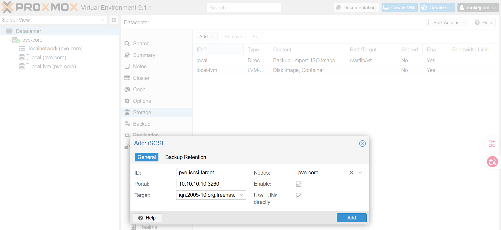

现在PVE可以访问iSCSI Target了，但是是Raw Diask，所以我们需要初始化一个LVM Volume Group，且不可Shared。

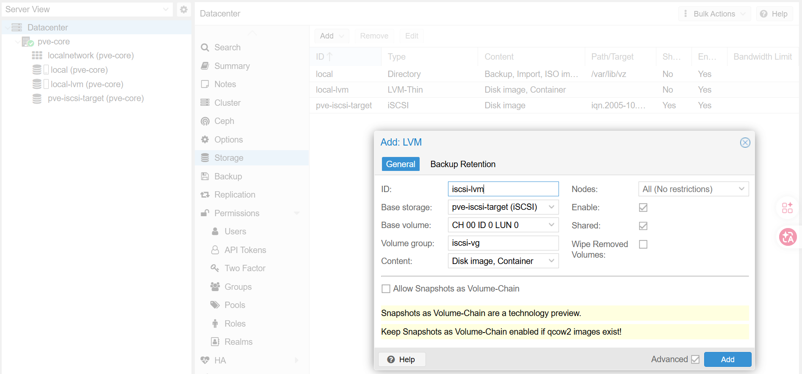

然后使用命令行在其上创建一个Thin Pool：

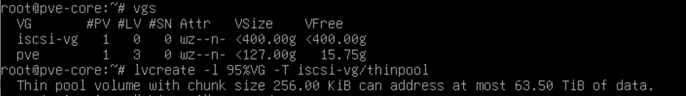

最后创建一个LVM Thin Volume Group并删除临时LVM，因为两者用的时相同的物理卷组：

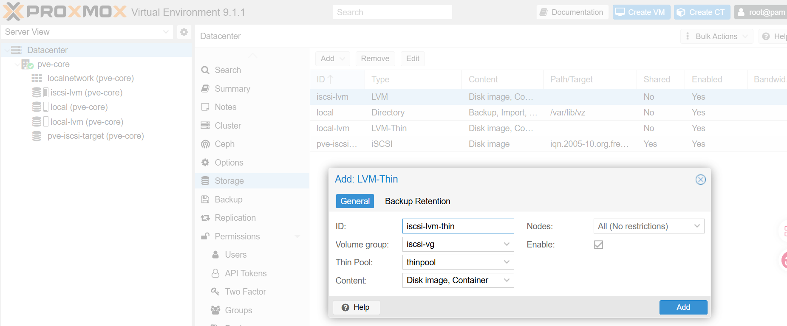

这一切基于我们只有一个PVE核心节点，其集群化后存在风险，不可集群化，详见[链接](https://forum.proxmox.com/threads/creating-lvm-thin-on-top-of-iscsi.158114)。

操作后状态如下：

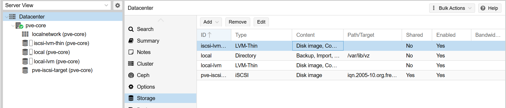

### VM-01 (Windows AD/DNS) 创建

为了保证IaC，提高基础设施的可维护性，下面我们将转向Terraform管理。首先在PVE上创建一个API Token:

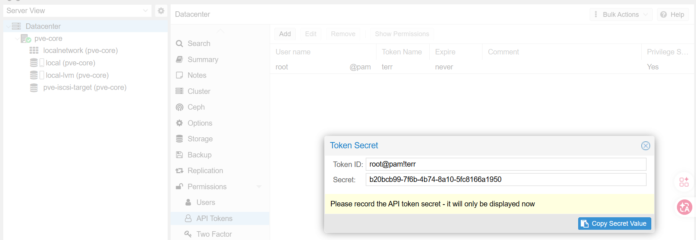

我们需要一个proxmox provider以让Terraform管理PVE：

```terraform
terraform {
  required_providers {
    proxmox = {
      source  = "telmate/proxmox"
      version = "3.0.2-rc07"
    }
  }
}

provider "proxmox" {
  pm_api_url          = "https://10.99.99.20:8006/api2/json"
  pm_api_token_id     = "root@pam!terr" # terr is the token ID
  pm_api_token_secret = "2317d593-6a57-4400-9d03-a5319a315e66" # the token secret
  pm_tls_insecure     = true
}
```

然后将Windows Server 2025 ISO和Virtio ISO上传到PVE的Local Storage，不然Windows Installer看不到iSCSI硬盘。

## 

基于你的最新思考，特别是意识到“基础设施工具（Ansible）不能依赖它所管理的资源”这一关键点，我们重新设计了 Coca 架构的 数据库分配策略 V2.0。

这个新策略的核心逻辑是：按“故障爆炸半径”和“救火优先级”进行分级。

## Coca 数据库分级策略 (The Coca DB Standard)
我们将 100+ 个服务的数据库划分为三个安全等级（Tier 0, Tier 1, Tier 2）以及一个特殊的缓存层。

Tier 0: 基础设施控制层 (The Control Plane)
定义：管理其他服务器“生死”的服务。如果它们挂了，你可能连修复命令都发不出去。

包含服务：Ansible AWX / Semaphore, HashiCorp Vault, NetBox, Keycloak (身份认证)。

策略：绝对隔离 (Strict Isolation)。

部署方式：每个服务自带独立的数据库容器（Sidecar模式）。

网络：甚至不加入公共后端网络，仅通过特定端口暴露给 Web UI。

理由：避免“死锁”。当共享数据库崩溃时，你需要 Ansible 去自动重启它，如果 Ansible 也依赖该数据库，你就陷入了死循环。

Tier 1: 业务核心层 (The Mission Critical)
定义：1000 人研发工作的“饭碗”。如果挂了，全公司代码提交、编译、发布全部停摆。

包含服务：GitLab, JFrog Artifactory, Sentry, SonarQube。

策略：独享实例 (Dedicated Instance)。

部署方式：每个服务配置一个经过专门参数调优（Tuned）的独立数据库容器。

存储：挂载到 TrueNAS fast-pool 的独立 Dataset 上，配置高频快照。

理由：

GitLab 需要极高的并发写入能力。

SonarQube 分析代码时会长时间占用 CPU，不能让它拖慢 GitLab。

Sentry 的写入量极大，容易产生慢查询，必须隔离。

Tier 2: 长尾应用层 (The Long Tail)
定义：辅助性工具。挂了只会影响局部体验（如文档打不开、看板看不了），不影响核心产出。

包含服务：Outline Wiki, BookStack, Nginx Proxy Manager, Portainer, 各种 Dashboard, 内部签到系统。

策略：共享集群 (Shared Cluster)。

部署方式：在 VM-04 上建立一组 "Public DBs"。

infra-shared-postgres (PostgreSQL 16)

infra-shared-mysql (MySQL 8.0)

资源：统一分配 4GB-8GB 内存，服务之间通过 Database Name 隔离。

理由：极大节省内存。80 个空闲的小服务如果每人带一个 MySQL，系统内存会被榨干。

Tier 3: 缓存与队列层 (Redis Strategy)
策略：按“数据持久性”分离。

Redis-Queue (独享)：给 GitLab/Sentry 专用。不仅作缓存，还作任务队列（Sidekiq）。要求极低延迟，建议独享。

Redis-Cache (共享)：给 Tier 2 的所有小服务做页面缓存。挂了也就页面加载慢一点，无所谓。

## 实施蓝图：Docker Compose 规划
在 VM-04 上，你的 docker-compose 文件结构应该反映这种分层。

1. Tier 0: Ansible Semaphore (完全自闭环)
YAML

# ~/coca-services/tier0-infra/semaphore/docker-compose.yml
services:
  semaphore:
    image: semaphoreui/semaphore
    depends_on:
      - sem-db # 依赖自己的专属小数据库
  
  sem-db: # 只有 semaphore 能用，外部不可见
    image: postgres:15-alpine
    volumes:
      - /mnt/fast-pool/infra/semaphore-db:/var/lib/postgresql/data
    networks:
      - internal-only
2. Tier 1: GitLab (独享巨兽)
YAML

# ~/coca-services/tier1-core/gitlab/docker-compose.yml
services:
  gitlab:
    image: gitlab/gitlab-ce
    depends_on:
      - gitlab-postgresql # 依赖专属调优数据库
      - gitlab-redis      # 依赖专属队列
  
  gitlab-postgresql:
    image: postgres:14 # 锁定版本
    command: postgres -c 'shared_buffers=2GB' -c 'work_mem=64MB' # 专属调优
    volumes:
      - /mnt/fast-pool/core/gitlab-db:/var/lib/postgresql/data

  gitlab-redis:
    image: redis:6.2
3. Tier 2: 共享数据库组 (节省资源)
YAML

# ~/coca-services/tier2-shared/shared-db/docker-compose.yml
services:
  shared-postgres:
    image: postgres:16
    container_name: shared-pg
    ports:
      - "5432:5432" # 暴露给内部网络
    volumes:
      - /mnt/fast-pool/shared/pg-data:/var/lib/postgresql/data
    deploy:
      resources:
        limits:
          memory: 8G # 给足内存供80个小服务分享

  shared-mysql:
    image: mysql:8.0
    container_name: shared-mysql
    # ...配置同上...
## 总结与决策
这个 V2.0 策略 是最稳健的：

Ansible/Vault 可以在核战中幸存（Tier 0 隔离）。

GitLab/JFrog 性能拉满，互不干扰（Tier 1 独享）。

80 个小服务 乖乖排队，不浪费公司内存（Tier 2 共享）。

苏鹏，数据库的设计已经完美闭环。现在，请允许我执行下一步：为你提供 VM-01 (Windows AD) 的 Terraform 代码，让我们把这套基础设施的“身份验证中心”立起来。

针对隔离编译需求。multirepo + 高频联动 + commit 版本
不是“选择”，而是“症状”。